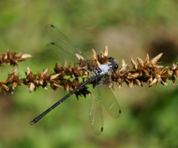
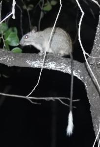

```{r setup, include=FALSE}
knitr::opts_chunk$set(echo = TRUE, 
                      eval = TRUE,
                      include = TRUE,
                      fig.align='center')

pacman::p_load(remotes, galah, tidyverse, alphahull, sp, sf, ozmaps, hull2spatial, patchwork)


galah_config(email = "fonti.kar@gmail.com", 
             atlas = "Australia",
             download_reason_id = 10 # testing
             )
```

In conservation ecology, convex hulls and alpha hulls are used to [quantify IUCN metrics such as, Area of Occupancy and Extent of Occurrence](https://www.ala.org.au/spatial-portal-help/aoo/) to describe the distribution of a particular species. Typically, convex and alpha hulls are used when dealing with **data deficient species**.

Here, we will walk you through how to create and plot your own convex and alpha hulls using ALA data. We will also showcase some **recent research** that puts these spatial polygons to use for biodiversity conservation. These spatial visualizations are a great alternative to plotting point based species occurrence records!

We'll start by installing/loading some R packages which we'll need:

```{r, eval = FALSE, class.source = "fold-show"}
#install.packages("pacman")

pacman::p_load(remotes, galah, tidyverse, alphahull, sp, sf, ozmaps, patchwork)
```

### An eye-catching example

We will use occurrence records of an endemic damselfly, *Austroargiolestes calcaris*, commonly known as the [Powdered Flatwing](https://bie.ala.org.au/species/https://biodiversity.org.au/afd/taxa/2d944503-2f03-48ec-8a8a-b78bc2b674af) to illustrate the various spatial polygon you can make

<center>{width="7.9cm"}</center>

Lets use `galah` to access records from the [Atlas of Living Australia](https://www.ala.org.au/). Note that you will need to first set up your own [ALA configuration locally](http://galah.ala.org.au/articles/download_data.html?q=config#configuring-galah) using `galah_config` before fetching records.

```{r, cache=TRUE, results='hide'}
galah_call() |> 
  galah_identify("Austroargiolestes calcaris") |> 
  galah_filter(profile="ALA") |> 
  galah_select(group = "basic") |> 
   atlas_occurrences() -> dfly
```

### Essential data cleaning 

We need to first remove **all duplicates and missing values**,, before we can launch into plotting our data,

```{r, class.source = "fold-show"}
# De-duplication
dfly |> 
  filter(! duplicated(decimalLongitude) & ! duplicated(decimalLatitude)) -> dfly_ddup

# Exclude NA in coordinates
dfly_ddup |>  
  filter(! is.na(decimalLongitude) & ! is.na(decimalLatitude) ) -> dfly_clean
```

### Convex hull of ALA occurences

A convex hull is defined as the smallest polygon that encloses all the points in the data set. Put simply, its a way to draw around all the points with as few lines as possible! Here's are the key steps to computing and plotting a convex hull that surrounds the occurrences of the Powdered Flatwing.


```{r, out.width = '90%', class.source = "fold-show"}
# 1. Compute convex hull
dfly_clean |> 
  select(decimalLongitude, decimalLatitude) |>  
  chull() -> dfly_chull

# 2. Create the outline of the hull but joining the hull vector together
dfly_chull_pts <- c(dfly_chull, dfly_chull[1])

# 3. Getting a polygon of Australia and set it to a specific coordinate system
aus <- st_transform(ozmaps::ozmap_country, 4326)

# 4. Plot the occurrences and convex hull
ggplot() + 
  geom_sf(data = aus, colour = "black", fill = "white")  + 
  geom_point(data = dfly_clean, aes(decimalLongitude, decimalLatitude), colour = "black", size = 0.8) + 
  geom_polygon(data = dfly_clean[dfly_chull_pts, ], aes(decimalLongitude, decimalLatitude), fill = "orange", colour = "black", alpha = 0.5) + 
  coord_sf(xlim=c(142, 152),ylim=c(-32,-44)) +
  labs(title = "Convex hull", x = "Longtitude (DD)", y = "Latitude (DD)") + ## DD here stands for decimal degrees
  theme_bw() -> dfly_chull_p

dfly_chull_p
```

### Alpha shape of ALA occurences

A convex hull is actually a simplified form of an *alpha shape*. Alpha shapes have an *alpha parameter* that controls the level of detail, or how tightly the boundary fits around the point set.

Lets make some alpha shapes for the Powdered Flatwing with increasing values of alpha. We will use a customised function named `extract_polygons` for extracting the polygon outline from an `ashape` object so we can plot it with `ggplot2`.

```{r extract_polygons, class.source = "fold-show"}
extract_polygons <- function(alpha_shape_obj)
{
  if(class(alpha_shape_obj) != "ashape") stop("extract_polygons requires an ashape")
  edge.df <- as.data.frame(alpha_shape_obj$edges)
  groups <- ns <- xs <- ys <- numeric(nrow(edge.df))
  m <- cbind(edge.df[[1]], edge.df[[2]])
  group <- 1
  repeat {
    i <- which(groups == 0)[1]
    if (length(i) == 0 | is.na(i)) break()
    j <- n <- 1
    repeat {
      groups[i] <- group
      ns[i] <- n
      if(j == 1) xs[i] <- edge.df$x1[i] else xs[i] <- edge.df$x2[i]
      if(j == 1) ys[i] <- edge.df$y1[i] else ys[i] <- edge.df$y2[i]
      next_ind <- which((m[, j] == m[i, j] | m[, (j %% 2 + 1)] == m[i, j]) & groups == 0)
      if (length(next_ind) == 0) break()
      j <- which(m[next_ind,] == m[i, j]) %% 2 + 1
      i <- next_ind
      n <- n + 1
    }
    group <- group + 1
  }
  data.frame(x = xs, y = ys, group = as.factor(groups))[order(groups, ns), ]
}
```

```{r, fig.width=12, fig.height=6, class.source = "fold-show"}
# 1. Compute alpha shapes and store in list column within a tibble
tibble(
  alpha_value = c(1, 2, 5),
  ashape_ls = map(.x = c(1, 2, 5),
               .f = ~ dfly_clean |> 
                 select(decimalLongitude, decimalLatitude) |> 
                 ashape(alpha = .x)) 
) -> dfly_ashapes


# 2. Extract polygons 
dfly_ashapes |> 
  mutate(ashape_polygons = map(.x = ashape_ls,
                               .f = extract_polygons)) -> dfly_ashapes

# 3. Plot alpha shapes with occurrence points

##  A function to compose map 
plot_ashape_fun <- function(polygon_data, title){
  p <- ggplot() + 
    geom_sf(data = aus, colour = "black", fill = "white")  +
    geom_point(data = dfly_clean, aes(decimalLongitude, decimalLatitude), size = 0.5) + 
    geom_polygon(data = polygon_data, aes(x, y), fill = "orange", colour = "black", alpha = 0.5) +
    coord_sf(xlim=c(142, 152),ylim=c(-32,-44)) +
    ggtitle(paste("a = ", as.character(title))) +
    labs(x = "Longtitude (DD)", y = "Latitude (DD)") + 
    theme_bw(base_size = 12)
}

dfly_ashapes |> 
  mutate(ashape_maps = map2(.x = ashape_polygons,
                            .y = alpha_value,
                            .f = ~ plot_ashape_fun(.x , .y)) 
         ) -> dfly_ashapes

wrap_plots(dfly_ashapes$ashape_maps)
```

Notice as the alpha value gets larger, the more simplified the alpha shape becomes.

### Alpha hull of ALA occurrences

Alpha hulls are another extension of alpha shapes, they are unique because of their arched edges. We rely on an R package `hull2spatial` developed by Cecina Babich Morrow. Check out their [blog post](https://babichmorrowc.github.io/post/2019-03-18-alpha-hull/) on how the package was made. The package allows us to converts `ahull` objects into ggplot-friendly objects. You can install this package using:

```{r, eval = FALSE}
# install.packages("remotes)
remotes::install_github("babichmorrowc/hull2spatial")
```

```{r, class.source = "fold-show"}
# 1. Turn ALA occurrence data into a `sf` object
dfly_clean |> 
  st_as_sf(coords = c("decimalLongitude", "decimalLatitude"), crs = 4326) -> dfly_sf

# 2. Compute an alpha hull for our occurrences
dfly_clean |> 
  select(decimalLongitude, decimalLatitude) |> 
  ahull(alpha = 2) -> dfly_ahull

# 3. Transform our `ahull` object into a `sp` object
hull2spatial::ahull2poly(dfly_ahull) -> dfly_sp_df

# 4. Lastly transform `sp` object into a `sf` object
dfly_sp_df |> 
  st_as_sf() -> dfly_sf_ahull

# 5. Set the coordinate system using `aus` object
dfly_sf_ahull %>% st_set_crs(st_crs(aus)) -> dfly_sf_ahull
```

```{r, out.width = '90%'}
# Plot the occurrences and alpha hull
ggplot() + 
  geom_sf(data = aus, colour = "black", fill = "white")  +
  geom_sf(data = dfly_sf, colour = "black", size = 0.5) +  
  geom_sf(data = dfly_sf_ahull, fill = "orange", alpha = 0.5) +
  coord_sf(xlim=c(142, 152),ylim=c(-32,-44)) +
  ggtitle("Alpha hull") +
  labs(x = "Longtitude (DD)", y = "Latitude (DD)") + 
  theme_bw() -> dfly_ahull_p

dfly_ahull_p
```

### Alpha hull of ALA occurrences using specimen data

Often citizen science data are excluded from scientific analyses due to it's poor data quality. You'll notice that when we exclude citizen science data for the Powdered Flatwing our number of records drop significantly. Although we've lost more than half our records we can still compute and plot alpha hulls - this is the beauty of them!

We are going to repeat the above steps for generating an alpha hull excluding citizen science data. Remember you still need to clean this data set as above

```{r, cache=TRUE, results='hide', class.source = "fold-show"}
# Create a vector excluding human observations
institution_only <- c("PRESERVED_SPECIMEN", "LIVING_SPECIMEN", 
                   "MACHINE_OBSERVATION", "MATERIAL_SAMPLE", "OBSERVATION")

galah_call() |> 
  galah_identify("Austroargiolestes calcaris") |> 
  galah_filter(basisOfRecord == institution_only,
               profile = "ALA") |> 
  galah_select(group = "basic") |> 
   atlas_occurrences() -> dfly_specionly
```

```{r, include=FALSE}
# Deduplication
dfly_specionly |> 
  filter(! duplicated(decimalLongitude) & ! duplicated(decimalLatitude)) -> dflysp_ddup

# Exclude NA in coordinates
dflysp_ddup |>  
  filter(! is.na(decimalLongitude) & ! is.na(decimalLatitude) ) -> dflysp_clean

# Turn ALA occurrence data into sf object
dflysp_clean |> 
  st_as_sf(coords = c("decimalLongitude", "decimalLatitude"), crs = 4326) -> dflysp_sf

# Compute an alpha hull for our specimen only occurrences
dflysp_clean |> 
  select(decimalLongitude, decimalLatitude) |> 
  ahull(alpha = 2) -> dflysp_ahull

# Transform our `ahull` object into a `sp` object and then into a `sf` object
hull2spatial::ahull2poly(dflysp_ahull) |> 
  st_as_sf() -> dflysp_sf_ahull

# Set the coordinate system using `aus` object
dflysp_sf_ahull %>% st_set_crs(st_crs(aus)) -> dflysp_sf_ahull
```

```{r, out.width = '90%', class.source = "fold-show"}
ggplot() + 
  geom_sf(data = aus, colour = "black", fill = "white")  +
  geom_sf(data = dflysp_sf, colour = "black", size = 0.5) +  
  geom_sf(data = dflysp_sf_ahull, fill = "orange", alpha = 0.5) +
  coord_sf(xlim=c(142, 152),ylim=c(-32,-44)) +
  ggtitle("Specimen only alpha hull") +
  labs(x = "Longtitude (DD)", y = "Latitude (DD)") + 
  theme_bw() -> dflysp_ahull_p

dflysp_ahull_p
```

### Alpha hulls in Biodiversity Research

Ok, so now we can create convex hulls, alpha shapes and alpha hulls using data from `galah` in R, what application does this have?

Recently, [Dr. Marsh and colleages](https://onlinelibrary.wiley.com/doi/full/10.1111/geb.13550) used alpha hulls to calculate the impact the 2020 mega bush fires on invertebrates in southern Australia. Data for invertebrates are inherently sparse so alpha hulls can be helpful when you only have a handful of records to work with.

[Dr. Takach and their team](https://onlinelibrary.wiley.com/doi/10.1111/ddi.13145) used alpha hulls to understand how the Australian tropical savanna mammal distributions have changed over time. For example, distributions can shrink or expand due to habitat loss or in response to changing climate. Dr. Takach found that the [Black-Footed Tree Rat *Mesembriomys gouldii*](https://biocache.ala.org.au/occurrences/c6e1ff2d-ac80-4cc1-806c-6107e8e24617) experienced a range contraction.

<center>{width="7.9cm"}</center>

The research paper didn't supply visualiations of their alpha hulls, so here we've plotted what the range reduction looks like using all records available vs. only records after the year 2000 for the Black-Footed Tree Rat using the workflow we've outlined above.

```{r include=FALSE, cache = TRUE}
galah_call() |> 
  galah_identify("Mesembriomys gouldii") |> 
  galah_filter(profile = "ALA") |> 
  galah_select(group = "basic") |> 
   atlas_occurrences() -> tree_rat

# Deduplication
tree_rat |> 
  filter(! duplicated(decimalLongitude) & ! duplicated(decimalLatitude)) -> tree_ratddup

# Exclude NA in coordinates
tree_ratddup |>  
  filter(! is.na(decimalLongitude) & ! is.na(decimalLatitude) ) -> tree_ratclean

# Turn ALA occurrence data into sf 
tree_ratclean |> 
  st_as_sf(coords = c("decimalLongitude", "decimalLatitude"), crs = 4326) -> tree_rat_sf

# Compute an alpha hull for our specimen only occurrences
tree_ratclean |> 
  select(decimalLongitude, decimalLatitude) |> 
  ahull(alpha = 2) -> tree_rat_ahull

# Transform our `ahull` object into a `sp` object and then into a `sf` object
hull2spatial::ahull2poly(tree_rat_ahull) |> 
  st_as_sf() -> tree_rat_sf_ahull

# Set the coordinate system using `aus` object
tree_rat_sf_ahull %>% st_set_crs(st_crs(aus)) -> tree_rat_sf_ahull

# Records only after 2000
galah_call() |>
  galah_identify("Mesembriomys gouldii") |>
  galah_filter(profile = "ALA",
               year >= 2000,) |>
  galah_select(group = "basic") |>
   atlas_occurrences() -> Rtree_rat

# Deduplication
Rtree_rat |> 
  filter(! duplicated(decimalLongitude) & ! duplicated(decimalLatitude)) -> Rtree_ratddup

# Exclude NA in coordinates
Rtree_ratddup |>  
  filter(! is.na(decimalLongitude) & ! is.na(decimalLatitude) ) -> Rtree_ratclean

# Turn ALA occurrence data into sf 
Rtree_ratclean |> 
  st_as_sf(coords = c("decimalLongitude", "decimalLatitude"), crs = 4326) -> Rtree_rat_sf

# Compute an alpha hull for our specimen only occurrences
Rtree_ratclean |> 
  select(decimalLongitude, decimalLatitude) |> 
  ahull(alpha = 2) -> Rtree_rat_ahull

# Transform our `ahull` object into a `sp` object and then into a `sf` object
hull2spatial::ahull2poly(Rtree_rat_ahull) |> 
  st_as_sf() -> Rtree_rat_sf_ahull

# Set the coordinate system using `aus` object
Rtree_rat_sf_ahull %>% st_set_crs(st_crs(aus)) -> Rtree_rat_sf_ahull


```

```{r, fig.width=12, fig.height=6}
# Nice title
rat_title <- expression(italic("Mesembriomys gouldii "), "alpha hulls")

ggplot() + 
  geom_sf(data = aus, colour = "black", fill = "white")  +
  geom_sf(data = tree_rat_sf_ahull, aes(fill = "orange") ,alpha = 0.5, colour = "black", position = "identity") +
    geom_sf(data = Rtree_rat_sf_ahull, aes(fill = "blueviolet"), alpha = 0.5, colour = "black", position = "identity") +
  scale_fill_identity(guide = "legend",
                      name = "Record date ranges",
                      labels = c('All Records','2000 Onwards')) +
  guides(colour = guide_legend(override.aes = list(alpha = 0.1))) +
  coord_sf(xlim=c(125, 145),ylim=c(-20,-10)) +
  ggtitle(rat_title) +
  labs(x = "Longtitude (DD)", y = "Latitude (DD)") + 
  theme_bw() +
  theme(legend.position = "bottom") -> combinedtree_rat_ahull_p

combinedtree_rat_ahull_p 
```
